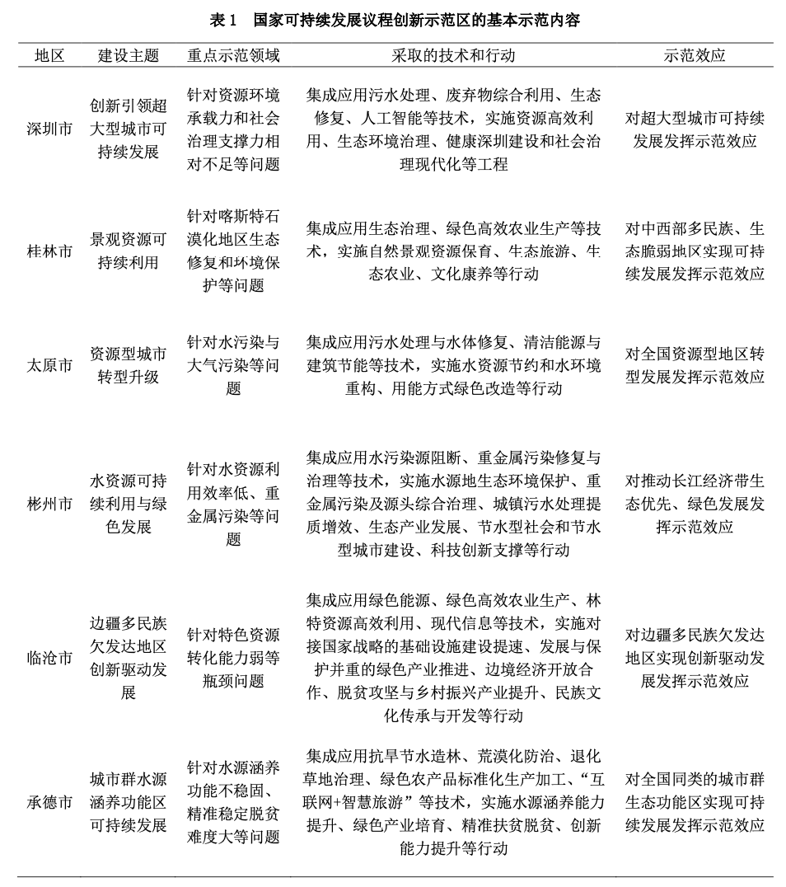

```{r setup, include = FALSE}
knitr::opts_chunk$set(echo = FALSE, message = FALSE, warning = FALSE, htmltools.dir.version = FALSE)
xaringanExtra::use_xaringan_extra(c("tile_view", # O
                                    "broadcast", 
                                    "panelset",
                                    "tachyons"))
library(pacman)
# Functions preload
set.seed(19970921)
```

## 分享主要内容

- 理论|国际-国内互动：一个合法化的视角

- 视窗|地方治理中的国际因素：一个政策扩散的视角

- 案例|“概念扩散”:一个可持续发展的在地故事

- 思考🤔与讨论💬

---

class: inverse, bottom

# 理论|国际-国内互动：一个合法化的视角

---

## 中国 与 世界

改革开放使得中国与世界的关系发生了历史性变化：

--

## 中国治理 与 国际因素

改革开放为国际因素介入地方治理提供了基本的前提

- 中国与国际社会的开放程度越来越大，大量国际制度、规则、价值等被中国接受和实践；

- 中国参与国际活动更加主动、领域广泛、主体多样

---

## 国内国际互动的国际关系研究

- 影响国内行为的四类因素(Gourevitch, 1978)：

国家体系、国际经济、观念和意识形态

- 从外交博弈到国内确认（Putnam, 1988）

------

.navy[全球化对国际-国内互动的影响]

- 核心：国内国际互动的双向影响

- 研究单位：国家可分（群体、制度......）

.red[将“国内”因素当做一个整体，分析单位是“高政治”]

---

## 国内国际互动的合法性角度

合法性：“国家存在的正当性”(Schaar, 1984)

中央政府、地方政府、领导人等都是合法性的主体

- 国家和国际组织互动

> 国家要通过服从国际规则、承认国际价值、参与国际行动、承担国际责任来获得国际社会的承认，来获得合法性

- 国际因素和国内主体互动

> 国际因素进入国内社会，被.red[理解]、承认、接受和实践是获得合法性的过程

> .navy[国内政府依靠国际因素获得/丧失合法性？]


---

## 国际因素如何取得国内合法性

- 机制和过程：

施加压力、国家承诺、社会化(Pevehouse, 2002)

  - 国际制度在国内政治话语中出现
  
  - 国际制度对国内制度进行修正
  
  - 国内对国际的影响进行调整(Cortell & Davis, 2000)
  
- 要素和条件

  - 跨国行为体(Kappen, 1995)
  
  - 实践(Finnemore, 1996)
  
  - 文化匹配程度、话语、国内利益集团、社会化力量(Cortell & Davis, 2000)

---

## 沉下去：国际因素进入地方治理

国际关系：.red[将“国内”因素当做一个整体，分析单位是“高政治”]

地方为什么重要？

- 实践(Finnemore, 1996)

- 全球化条件下的地方自主性

- 地方政府直接参与国际治理

---

## 总要干叭？

.center[]

---

## 中央权威下的地方自主性

.center[]

---

## 地方政府直接参与国际治理

.center[]

---

## 国际因素进入地方治理

不仅是地方治理的.red[背景]，更参与到地方治理的“过程”

不仅是一个.red[本土化]的过程，还是一个.red[合法化]的过程

合法性来源：中央政府、地方政府和社会

---

## 中央权威提供合法性

国际因素的合法化首先要取得中央权威的承认。

- 坚持社会主义：“去资本主义化”、“去西方化”后才能进入政治话语

- 中央集权：中央对地方有着严格的控制

## 自上而下的垂直合法性机制

- 意识形态解禁

- 国家制度允许

- 领导人提倡

--

.center[不够]

---

## 地方政府提供合法性

地方自主性

- 地方决策

- 政策执行（灵活、自主性、变通）

合法性机制：

- 领导人对国际持开放态度

- 能够解决现实问题

- 有自主性

---

## 社会力量提供合法性

合法性机制

- 国际价值被社会公众接受

- 被特定的社会群体或组织倡导（NGO）

- 通过社会抗议争取

---

## 社会力量提供合法性

.center[]

---

## 社会力量不一定提供合法性

还会......被认为是

--

.center[.red[境外势力]]

.center[]


---

## “国际因素”到底是什么

- 利益：海外资本

- 制度：国际规则和组织

- 知识：治理的理念、方法和技术

---

## 国际因素进入地方治理的机制

“允许-回应”型：国家 + 地方

“接受-实践-参与”： 国家 + 地方 + 社会

“共同学习”：地方 + 社会

---

class: inverse, bottom

# 视窗|地方治理中的国际因素：一个概念扩散的视角

---

## 重要窗口

- 政策扩散是中央政府、地方政府和政策企业家的三维互动

- 观察变化

- 观察差异

---

## “中央点菜，地方买单”：中央权威与概念的扩散

政策试点

- 设立试点

- 挑选成功的典型个案

- 在更广泛的地区推广

???

中央政府作为“概念扩散”的发起者，其掌握着大量的资源，能够借助目标设定、预算分配和干部管理等多种机制影响概念扩散的过程。
“政策试点”是中央政府主导进行政策扩散的经典形式。
“政策试点”是指由地方发起或中央的改革和试验，成功之后上升为国家政策推广到全国，往往会出现一种“中央点菜，地方买单”的情景[@LiMiaoCuiJun2018; @KongWeiNaZhangGuang2013]。它更多地出现在中央集权体制的国家，它包括自下而上的学习吸纳和自上而下的强力推广两个过程的结合[@LinXueFei2015]，这一过程主要分成三个步骤：设立试点、挑选成功的典型个案、在更广泛的地区推广。[@Heilmann2018]。这种从政策试验到政策推广的“吸纳—辐射”是中国政策扩散的主要形式。[@ZhouWang2012]

---

## “民主实验室”：地方灵活性与概念的扩散

**对于作为内部行动者的地方政府来说，概念扩散并非单向被动接受的过程，而是一个主动选择的过程。**(GlickHays,1991; LinXueFei,2015)

- 主动性

- 地方能力


???

**对于作为内部行动者的地方政府来说，概念扩散并非单向被动接受的过程，而是一个主动选择的过程。**[@GlickHays1991; @LinXueFei2015]。因为任何概念或政策都可以通过明确拒绝或者偏差执行的方式进行应对。
内部行动者会根据其自身偏好与目标和外部行动者进行博弈，并根据其自身需要对概念进行具体化，以获得政治上的或是治理上的最有力的政策效果。

不同地方政府和中央政府博弈的空间并不相同，能力越强的政府对于概念解读的灵活性越大。
@ShipanVolden2008 通过考察禁烟政策在城市间采纳的异质性从自上而下和水平扩散两个层面进一步展现了地方政府能力对政策扩散的影响。地方能力强大的城市往往能够抵挡住中央政府政策压力，从而在政策扩散中具有更强的灵活性；地方能力弱小的城市往往会模仿中央或其他城市的政策，即使这些政策不适合他们自己的治理需要。

地方政府的灵活性主要来自于两个方面。
首先是主动性，如果这个概念同该地的发展需要或者是该地政治精英的偏好一致，地方政府就会更加主动地推动该概念落地，并结合自身治理现实或是需要对概念进行有差异的具体化；
其次，地方政府的能力是使得其能够根据自身偏好具体化概念的基础，能力较强的地方政府对中央概念扩散的灵活性就更强；能力较弱的地方政府在集体化中央概念时的灵活性较弱，更多的被中央的意志主导。

---

## “权威话语”：政策企业家与概念的扩散

中央政府是概念扩散的发起者，但并不一定是概念的提出者。
智库、国际组织、社会团体等政策企业家作为权威话语的拥有者，在生产概念和概念传播过程当中都扮演着重要的角色。
在议程设置阶段，他们会根据自己的目标界定政策议题的实质[@BaezAbolafia2002]；
在推广政策阶段，为了突出自身政策的优势，他们会形成政治联盟进行游说，在政策窗口来临前为自身的政策积蓄力量[@MintromVergari1996]。
**在推动政策扩散效果上，政策企业家推动政策扩散受到多种条件的影响。**
政策企业家所在组织的实力[@Schneider1989]、自身素质[@KingdonStano1984a]、政治联盟[@DoigHargrove1990]、受到的激励[@Teodoro2009]等因素都会影响到政策企业家能否参与并推动政策创新。


---

## 机制组合

.center[]

???

在此基础上，需由于在不同情景中中央政府、地方政府和政策企业家的影响组合和力量对比不同，概念扩散的类型也会产生差异。图1是“概念扩散”的八种理想类型。

---

class: inverse, bottom

# 案例|“概念扩散”:中央指令、地方灵活性、外部权威与SDG政策的地方扩散

---

## 上边的都还是假说

假说一：中央政府的行政指令影响概念扩散；

假说二：地方政府的主动性和能力影响着概念扩散；

假说三：政策企业家的行动影响者概念扩散；

假说四：不同的主体力量对比，会产生不同的概念扩散类型。

---

## 案例选择标准

- 中央政府对此概念的界定应当是模糊的，这是概念扩散和政策扩散最重要的差别；

- 这一模糊概念的扩散在需要由中央政府、地方政府和政策企业家共同参与，多主体的参与有利于我们对不同主体的角色进行分析；

- 不同地方对于这一相同概念的扩散结果应当产生较大差异，存在异质性我们才能够比较不同案例扩散机制的差异。

--

.center[中国各地“2030年联合国可持续发展议程”本地化]

---

## “2030年联合国可持续发展目标

.center[]

???

基于上述标准，笔者选择使用中国各地“2030年联合国可持续发展议程”本地化作为案例。
这一案例符合“多主体互动”的标准。
“2030年联合国可持续发展议程”是由各成员国共同提出，联合国开发计划署等机构作为职能机构负责推动；

可持续发展，作为一种新的发展理念，是顺应时代的变迁、社会经济发展的需要而产生的，是人类对进入工业文明以来所走过的道路进行反思的结果。现代可持续发展理念可追溯到20世纪60年代的《寂静的春天》，1972年联合国召开第一次人类环境大会，环境问题被正式纳入国际发展议程。在此后40多年的漫长探索中，全球可持续发展已经从单纯的理念转变为指导世界各国经济社会建设的重要战略和实践。2015年，联合国召开可持续发展峰会，正式通过了《2030年可持续发展议程》，绘制出未来全球可持续发展合作的蓝图、路径和方向。人类社会的发展观，已经悄然转变为天人合一、人与自然和谐相处的生态文明观。

2010年联合国大会授权启动了后千年发展目标（Post-MDG）和2015年后发展议程（Post2015 Development Agenda）的咨询和讨论。2012年“里约+20”联合国可持续发展首脑峰会决定建立开放工作组（Open Working Group, OWG）就可持续发展目标（Sustainable Development Goals，SDGS）展开谈判，后千年目标的咨询和讨论与之合并推进。经过近3年的准备，2015年9月在美国纽约召开的联合国可持续发展首脑峰会通过了成果文件《改变我们的世界：2030年可持续发展议程》。2016年1月1日，2030议程正式进入实施阶段，这是一部指导未来15年全球可持续发展的纲领性文件，标志全球可持续发展治理掀开新的篇章。

可持续发展目标（SDGs）是2030年可持续发展议程的核心内容，是各国政府经过两年多艰苦谈判取得的成果，为全世界所瞩目。它包括17目标和169个具体目标。2030年可持续发展目标从内容上可以分为5组，对应5P愿景：
第1-7项目标涉及消除贫困、消除饥饿、保障受教育权利、促进性别平等、享有水、环境卫生和能源服务等，主要体现保障人类自身发展的基本需求，特别是弱势群体的基本权利。
第8-12项目标涉及可持续经济增长和就业，可持续工业化和创新，减少不平等，建设可持续城市和人类住区，可持续的消费和生产等，重点在促进可持续的经济增长和社会包容。


---

## “可持续发展议程”在中国的实践

.center[]

???

作为世界上最大的发展中国家，中国高度重视落实2030年可持续发展议程，已全面启动可持续发展议程落实工作，在多个可持续发展目标上实现“早期收获”，并形成了一批可复制、可推广的可持续发展现实样板。

中国于2016年发布的《中国落实2030年可持续发展议程国别方案》、《中国落实2030年可持续发展议程创新示范区建设方案》将建设中国落实2030年可持续发展议程创新示范区（以下称“国家可持续发展议程创新示范区”）的思路和目标进一步明确，这是中国积极履行国际承诺，务实推进落实工作的具体体现，是中国针对国内外发展形势，深入实施创新驱动发展战略，切实解决发展中面临的不平衡、不协调、不可持续问题的重要举措。
国家可持续发展议程创新示范区建设机制。创新示范区建设采取政府、社会等多利益攸关方共同参与的机制。在组织机制上，成立了科技部牵头，外交部、国家发展改革委、生态环境部等20部门组成的部际联席会议机制，负责对创新示范区建设的指导和管理，并结合自身职责，围绕创新示范区建设主题，在科技支撑、政策先行先试等方面支持创新示范区建设。太原、F市、深圳以及郴州、承德、临沧市政府作为创新示范区建设的主体，均成立了由分管省领导牵头，相关省直部门负责人、示范区所在地政府主要负责同志任成员的示范区建设领导小组，形成了上下联动、协同推进的工作格局。社会参与方面，包括联合国开发计划署、联合国工业发展组织、亚洲开发银行以及中国科学院、清华大学、同济大学、中国可持续发展研究会等许多国际组织、科研院所、高校、企业、非政府组织等积极参与创新示范区建设，多元参与的局面初步形成。 

国家可持续发展议程创新示范区建设实践。国务院于2018年、2019年批复了6个国家可持续发展议程创新示范区，既有深圳这样发达的特大型城市，又有发展中的旅游资源优质的城市——F市市和临沧市，也有太原这样的资源型城市，还有承德和郴州等重要的水源涵养地，并且本着"一个区域一套方案"的原则，对其可持续发展提出了不同的定位和要求（表1）。国家可持续发展议程创新示范区均开展了积极行动，制定了中长期可持续发展规划，积极探索可持续发展的新路径，取得了明显成效。如深圳市大力实施资源高效利用、生态环境治理、健康深圳建设和社会治理现代化‘四大工程’, 健全创新服务支撑和多元人才支撑‘两大体系’的建设思路,完善资源环境的管控机制、社会治理的服务机制、创新创业的动力机制和人才教育的保障机制‘四个机制’”，整体可持续发展水平已经超过了超大型城市平均水平，但与国际先进城市相比，仍有一定距离和提升空间。 太原市聚焦水、大气污染瓶颈，推进水资源节约和水环境重构、生产生活用能方式绿色改造两大行动52项工程项目实施，累计治理九河河道面积313.6万平方米，建设快速交通156公里，实现了中心城区与东西山地区的快速通达，水清岸绿、山水一体、河湖连通的水韵龙城新格局初步形成，探索的“西山模式”也成为了国家可持续发展议程示范区建设的典型经验。 

```{R ,echo = FALSE, out.width = '90%', fig.align="center"}

```

---

## 为什么选择这个案例

- 多主体互动

- 模糊性

- 差异性

???

这一案例符合“多主体互动”的标准。
“2030年联合国可持续发展议程”是由各成员国共同提出，联合国开发计划署等机构作为职能机构负责推动；
作为世界上最大的发展中国家，中国高度重视落实2030年可持续发展议程，将其写入“十三五”规划，全面推动可持续发展议程落实工作，并分两批设置六个“国家可持续发展议程创新示范区”。
中国各地方政府作为“2030年可持续发展议程”本地化的主要负责组织，不仅将“2030年可持续发展议程”写入各地的发展规划，还积极和联合国开发计划署开展国际合作。
在“2030年可持续发展议程”中国本地化的过程中，中央政府是主要推动者和概念的外部先行者，各地方政府是主要承接者和内部的政策制定者，联合国开发计划署扮演的是政策企业家和外部的权威话语拥有者的角色。
在此案例中，虽然中央政府从多个角度提出了落实“2030年可持续发展议程”的国别方案，但是对于地方的落实，这一方案还是总体性、原则性和模糊的；
对于模糊的政策，各地结合产生了不同的概念扩散结果。

在数据来源上，笔者主要使用结构式访谈的方式对中国“2030年联合国可持续发展议程”本地化的主要行为者“联合国开发计划署驻华代表处（UNDP in China）”的官员进行直接数据收集，并通过其反馈和本地化项目成果间接的对中央政府和地方政府进行数据收集。
在分析方法上，笔者主要通过比较案例分析对中央模糊概念扩散到地方的过程和机制进行实证检验。

---

## 变量测量

.center[]

---

## 类型组合

.center[]

---

## 中央主导型：华北A市

- 国家可持续发展议程创新示范区，明确建设重点

- 《A市国家可持续发展议程创新示范区2018年度工作方案》.red[具体化，但多重复，无概念创新]

- A市科技局负责与联合国开发计划署对接，但是合作深度较浅，没有建设明确的项目部和专项项目。其合作仅限于A市派人参加联合国在国内外开展的论坛培训活动

A市的可持续发展建设属于中央政策主导，联合国机构在其中扮演的角色并不多，更多的是给A市提供一个输出的舞台，而非联合国提供专业知识

???

山西太原的“2030年联合国可持续发展议程”本地化进程属于中央主导型。 2018年2月13日，中国国务院发布《国务院关于同意太原市建设国家可持续发展议程创新示范区的批复》，同意太原市以资源型城市转型升级为主题，建设国家可持续发展议程创新示范区，明确太原市可持续发展议程建设的重点是资源型城市转型升级。 2018年4月20日，太原市人民政府办公厅发布《太原国家可持续发展议程创新示范区2018年度工作方案》，对国务院上述批复进行具体化，但是较少提出新的概念或者落实路径。 在和联合国的合作过程中，太原市科技局负责与联合国开发计划署对接，但是合作深度较浅，没有建设明确的项目部和专项项目。其合作仅限于太原市派人参加联合国在国内外开展的论坛培训活动， 2018年召开的联合国大会展示了太原建设可持续发展议程创新示范区的成果，此后在多项与联合国相关的国际会议上，太原市也有受邀介绍相关经验。 但是总体来说“太原市的可持续发展建设属于中央政策主导，联合国机构在其中扮演的角色并不多，更多的是给太原提供一个输出的舞台，而非联合国提供专业知识。”

--

## 地方主导型：华东B市

- 非政策试点

- 地方政府主动

- 联合国深度参与

B市某区政府主要负责，和联合国开发计划署(UNDP)、联合国项目事务署(UNOPS)、中国商务部中国国际经济技术交流中心(CICETE)合作开展“联合国/国际组织可持续采购服务、信息分享与能力建设项目”。2021年6月“联合国/国际组织可持续采购服务、信息分享与能力建设项目”，落地B市同联创新产业园区。

???

有趣的是，和其他地方政府主动联系联合国不同，上海市政府和联合国的伙伴关系，是由联合国开发计划署主动发起的，并且是其伙伴关系中重要的“创新试点项目”之一。 同其他政府主动投入资金和联合国签订合作协议不同，上海市政府利用其主动性和治理能力，将联合国的资源吸纳到本地，作为助力推动地区的发展。

---

## 外部主导型：中部C市

- 非政策试点

- 地方主动，但能力较弱治理资源和话语权威有限

- 联合国占有话语知识主导权

???

河南省内乡县的可持续发展项目是联合国减贫与可持续发展首个县级示范项目。2017年11月14日，内乡县政府、牧原集团与联合国开发计划署(UNDP)驻华代表处在北京达成在内乡建设联合国可持续发展目标示范区(示范村)项目的意向。
内乡和企业(牧原)创新实施的“5+”扶贫模式引起联合国高度关注，将内乡升级建设成为联合国可持续发展目标示范区。“5+”扶贫模式是一个多方共赢模式，实现了政府、银行、龙头企业、贫困户的多方共赢。
中央政府的政策指令和物质激励都是模糊的，虽然内乡县领导班子直接参与同联合国机构对接，但是由于其治理资源和话语权威有限，这一本地化过程更多的被外部政策企业家联合国所主导。 联合国开发计划署将内乡项目作为其重点的示范项目。

## 央地协作型：华南D市

- “国家可持续发展议程创新示范区”，任务明确

- 地方政府积极，市政府直接负责推进和对接工作，主导本地化过程

- 联合国：“对接部门权力小、话语权较弱，联合国的合作产出受限”，更多的扮演者观察和背书的角色

--

明显的央地协作色彩，国家指令明确，地方政府积极主动，外部政策企业家发挥的作用较少。

???


央地协作型。 深圳市作2018年3月第一批为“国家可持续发展议程创新示范区”，承接着国家“创新引领超大型城市可持续发展”的试点任务。 深圳市政府直接负责推进和对接工作，主导本地化过程。2019年举办《落实2030年可持续发展议程论坛（中国深圳）》，论坛主题为“坚持创新驱动，支撑可持续发展”，发布《深圳可持续发展综合评价体系研究》报告。深圳可持续发展研究院也将揭牌。2021年11月18日，世界创新城市论坛在深圳举行，“共建开放创新平台，应对时代发展挑战”为主题。深圳市市长覃伟中、联合国开发计划署（UNDP）驻华代表白雅婷参加论坛并致辞。 虽然同联合国开发计划署签署备忘录进行合作，但是主要由深圳市科创委负责对接，“对接部门权力小、话语权较弱，联合国的合作产出受限”，更多的扮演者观察和背书的角色。 深圳的“2030年联合国可持续发展议程”本地化体现出明显的央地协作色彩，国家指令明确，地方政府积极主动，外部政策企业家发挥的作用较少。

---

## 内部外部互动型：华东E市

- 并非不是国家示范区

- 市政府高度重视可持续发展议程的推动；和一般由科技部门对接不同，扬州市政府的可持续发展议程本地化工作由职能部门外事办负责

- 联合国开发计划署将E市项目的主要目标设置为“国际伙伴关系建设”，合作开发首个应用于运河城市的联合国2030可持续发展目标进展评估体系，共同开展运河城市可持续发展领域相关研究。 深度参与E市可持续发展议程本地化过程。

???

江苏省扬州市的概念扩散体现出明显的内外部互动的色彩。扬州并非“国家可持续发展议程创新示范区”，中央行政约束较少。 但是扬州市政府高度重视可持续发展议程的推动，以及其在推动扬州国际影响力提高的关键作用。 和一般由科技部门对接不同，扬州市政府的可持续发展议程本地化工作由职能部门外事办负责。 扬州市在一般的联合国可持续发展议程基础上提出“运河城市”的可持续发展指标，并发布《扬州市运河城市可持续发展评估报告》，建立《运河城市可持续发展评估体系》，这是全球首个运河城市可持续发展评估系统。 联合国开发计划署将扬州市项目的主要目标设置为“国际伙伴关系建设”。2021年4月13日，在联合国开发计划署（UNDP）驻华代表处代表白雅婷（BeateTrankmann）与世界运河历史文化城市合作组织（WCCO）副主席张福堂共同签署建立合作伙伴关系谅解备忘录，双方确定，2021年，将合作开发首个应用于运河城市的联合国2030可持续发展目标进展评估体系，共同开展运河城市可持续发展领域相关研究。 深度参与扬州的可持续发展议程本地化过程。

---

## 中央外部协作型：华南F市

- “国家可持续发展议程创新示范区”的政策试点，承接着国家“景观资源可持续利用”的政策任务，中央指令明确

- 联合国机构在其中也扮演着重要的角色，和其他地方直接参与项目推进不同，在F市项目中，联合国开发计划署的首要任务是培训，告诉当地官员“什么是可持续发展议程”。 可以说，其从概念界定和议程设置阶段就深度参与F市的可持续发展议程。

- 中央外部话语竞争

???

在F市项目中，中央政策概念和联合国的政策理念出现了明显的话语竞争，地方政府一方面需要将中央概念作为其落实政策的方向基础， 又需要根据联合国机构的意见修改其政策的具体执行细则。 这在《F市可持续发展报告2021》中体现的十分明显，这份由联合国开发计划署项目组撰写的报告第一部分回应F市作为“国家可持续发展议程创新示范区”的建设成效， 最后一部分，从联合国政策理念的视角对其可持续发展建设的不足提出展望，进行议程设定。

## 无人主导型

- 缺乏中央明确指令

- 缺乏联合国机构的合作关系

- 地方政府也没有足够的主动性

???

无人主导型。 除此之外，如果缺乏中央明确指令和联合国机构的合作关系，地方政府也没有足够动机，那“可持续发展议程”就成为“无人主导型”：中央政府的提出“可持续发展议程”的概念，还会原封不动的扩散到各地方政府的发展规划和政策文本中，并不会进一步的落实为具体政策。

---

class: inverse, bottom

# 思考🤔与讨论💬

---

## 思考🤔与讨论💬

- 国际因素在地方治理中扮演着什么角色？

- 中国为什么要接纳国际因素进入地方治理？（国际合法性；政策拼盘）

???

政策扩散，并不一定通过清晰的政策文本扩散，往往会通过模糊的政策概念进行传递。 中央政府政策文件往往不会给出明确的执行细则，而是给出模糊的政策概念或是政策信号。 面对同样的信号，不同的地方政策制定者往往会有天差地别的理解。 本文在梳理已有理论的基础上，从政策扩散的主体和内容等视角出发，提出了“概念扩散”的视角。 在此基础上，笔者使用“可持续发展议程”在中国六个地区的差异性扩散作为案例，使用比较案例分析的方法， 对“概念扩散”的过程和在过程中受到“中央政府”、“地方政府”和“权威话语者”等主体的影响进行了实证检验。
笔者发现，在“可持续发展议程”本地化的过程中，中国中央政府扮演着概念推动者和政策先行者的角色，在中国提出这一概念并借助行政资源使用政策试点等方式推动其本地化。 虽然中央政府从多个角度提出了落实“2030年可持续发展议程”的国别方案，但是对于地方的落实，中央政府的界定还是总体性、原则性和模糊的； 各地方政府是主要承接者和内部的政策制定者； 除此之外，联合国开发计划署等联合国机构作为“可持续发展议程”在国际层面的提出者和倡导者扮演的是政策企业家和外部的权威话语拥有者的角色。
通过对比我们发现，由于主导主体和力量对比不同，“可持续发展议程”的概念扩散过程分为中央主导型、地方主导型、外部主导型、央地协作型、地方外部竞争型、中央外部竞争型、内部外部互动型和无人主导型七种类型。 对于不同类型的概念扩散过程，结果差异也较大，不同主体会将自身偏好施加在从“概念”到“政策”的翻译过程。对于多个主体参与的概念扩散，会出现明显的主体间协作或竞争的现象。


---
class: inverse, center, middle


# 蟹蟹 🦀️

[Mails: sunyf20@mails.tsinghua.edu.cn](mailto:sunyf20@mails.tsinghua.edu.cn) 

[Website: syfyufei](https://syfyufei.github.io/)

[Github: github.com/syfyufei](https://github.com/syfyufei)
