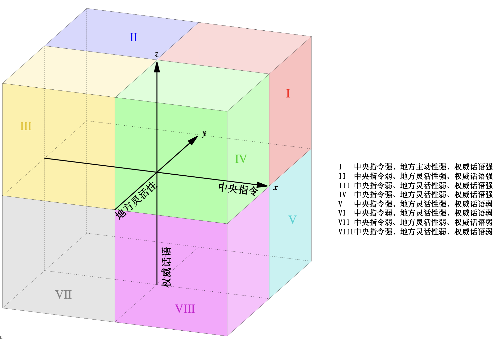
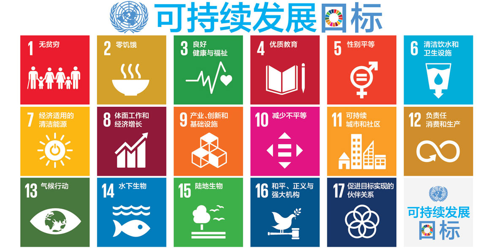
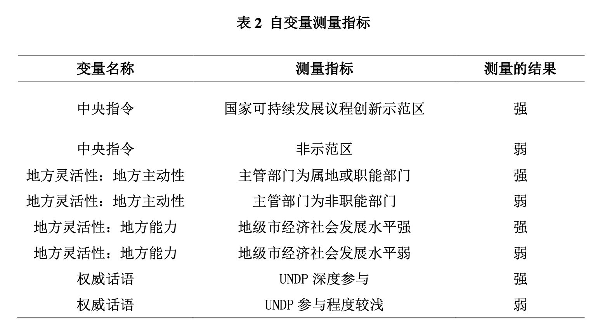
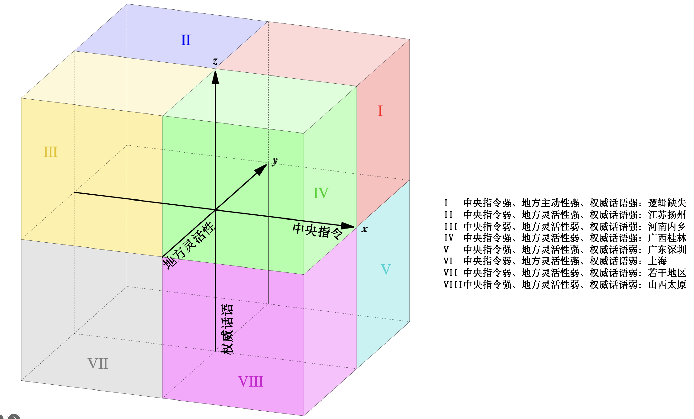
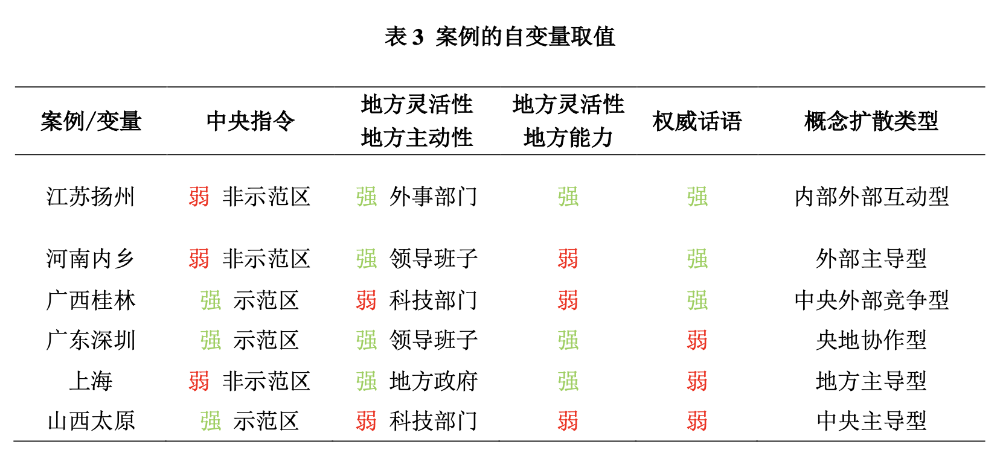

---
output:
  bookdown::pdf_document2:
    keep_tex: true
    fig_caption: true
    latex_engine: xelatex
    number_sections: true
  bookdown::word_document2:
    reference_docx: "template_CHN.docx"
    keep_md: true
    number_sections: FALSE
knit: (function(inputFile, encoding) {rmarkdown::render(inputFile, encoding = encoding, output_format = c("bookdown::word_document2", "bookdown::pdf_document2")) })
documentclass: ctexart

fontsize: 12pt
geometry: margin=1in
bibliography: SDGproject.bib
csl: "china-national-standard-gb-t-7714-2015-author-date.csl"
link-citations: true
colorlinks: true
toc: false
indent: true
always_allow_html: true

editor_options: 
  markdown: 
    wrap: sentence

title: '“概念扩散”：中央指令、地方灵活性、外部权威与模糊性政策的地方扩散'

author:
- 孙宇飞^[清华大学政治学系博士生，联系电话：18638750921，邮箱：sunyf20@mails.tsinghua.edu.cn]

abstract: |
  政策在政府间不仅通过清晰的文本扩散，还会通过模糊的政策概念进行传递。
  中央政府的政策往往不会给出明确的执行细则，而是给出模糊的概念或是信号。
  面对同样的政策信号，不同的地方政策制定者往往会有天差地别的理解。
  本文在梳理已有理论的基础上，从政策扩散的主体和内容等视角出发，提出了“概念扩散”的视角。
  在此基础上，笔者使用“可持续发展议程”在中国六个地区的差异性扩散作为案例，使用比较案例分析的方法，
  对“概念扩散”的过程和在过程中受到“中央政府”、“地方政府”和“权威话语者”等主体的影响进行了实证检验。
  
  笔者发现，在“可持续发展议程”本地化的过程中，
  中央政府首先提出一个模糊的概念；
  各地方政府是主要承接者和内部的政策制定者；
  联合国机构在此议题上扮演着政策企业家和外部的权威话语拥有者的角色。
  由于主导主体和力量对比不同，“可持续发展议程”的概念扩散过程分为中央主导型、地方主导型、外部主导型、央地协作型、地方外部竞争型、中央外部竞争型、内部外部互动型和无人主导型七种类型。
  对于不同类型的概念扩散过程，结果差异也较大。不同主导主体会将自身偏好施加在从“概念”到“政策”的翻译过程。对于多个主体参与的概念扩散，会出现明显的主体间协作或竞争的现象。
  
  
  **关键词**：政策扩散; 概念扩散; 全球化; 中央地方关系

---

\newpage

# 引言

当一个政治行为体进行政策制定时，会受到其他行为体既有政策的影响，这一过程通常被称为“政策扩散”。
作为政治话语的重要组成部分，公共政策是政治学重要的研究领域和数据来源，政策扩散是描述和解释公共政策传播的核心概念。
“政策扩散”是一个包括社会政策、经济政策、政治政策等各个政策领域的政策传播过程；是一个政府组织、政治精英、政策企业家、新闻媒体和民众等各个政治主体的政治互动过程；它贯穿从议程设置、到政策采纳、再到政策执行和反馈的政策全过程。

政策扩散包括水平和垂直两个方向，水平扩散是指政策在同级政府间进行政策扩散；
垂直方向的政策扩散描述的是政策扩散在中央政府和地方政府之间的传播过程，包括自上而下和自下而上两个部分。
其中，自上而下的政策推行，是中央集权体制政府政策扩散的重要途径。
现有研究从主体、内容、机制等视角对中央政府政策如何扩散到地方政府展开研究。

虽然现有研究为我们理解自上而下的政策扩散提供了有益的启发，但是它们大多关注于通过清晰的“文本”方式的政策扩散，即一个具体的措施是如何从中央扩散到地方政府的。
但在现实治理过程中**政策扩散并不一定通过清晰的政策文本扩散，往往会通过模糊的政策概念进行传递，这在自上而下的政策推行中尤为明显。**
在中国，中央行政命令（包括政府工作报告、法规、政策、规划、意见、通知、文件等）都会给地方进行政策创新的压力和合法性，
但中央政府政策文件往往不会给出明确的执行细则，而是给出模糊的政策概念或是政策信号。
面对同样的信号，不同的地方政策制定者往往会有天差地别的理解。
现有文献对这种模糊信号从中央到地方的扩散机制并未深入研究。

本研究在梳理已有理论的基础上，从政策扩散的主体和内容等视角出发，提出了“概念扩散”的视角，尝试用此概念描述模糊信号从中央拓展到地方的过程。
在此基础上，笔者使用“可持续发展议程”在中国六个地区的差异性扩散作为案例，使用比较案例分析的方法，对“概念扩散”的过程和在过程中受到“中央政府”、“地方政府”和“权威话语者”等主体的影响进行了实证检验。

# 自上而下的政策扩散：主体、机制和内容

作为中央参与地方治理的重要手段和央地关系重要的构成方式，自上而下的政策扩散受到学者的广泛关注，现有研究从主体、机制和内容等角度关注了这一政策传播过程。

## 自上而下政策扩散的主体：地方政府、中央政府和政策企业家

自上而下政策扩散的主体主要包括内部主体和外部主体，他们的偏好、目标、能力、政策环境和身份都深刻影响了政策从中央扩散到地方的过程。

自上而下政策扩散的内部主体是地方政府。
他们的是政策扩散的起点，主要包括个人偏好和外界影响的偏好。个人偏好受到其学历和个人经历[@HanWanQu2019]等因素的影响，外部影响主要包括受到民众[@Perez-ArmendarizCrow2010]、利益集团[@GarrettJansa2015]和其他政府的影响。
**内部行动者的偏好是由他们的目标塑造的。**
一般来说，作为政治人物，内部行动者的目标主要包括政治目标和治理目标两个方面。
治理目标主要包括扩大税基、增加收入、提供公共产品等现实治理需要。
不同类型的政府有着不同的政策扩散目标，中央集权体制国家的内部行动者对上级目标有着更高的优先级。@ZhuXuFengZhaoHui2016 发现和西方选举民主体制相比，中国地方政府在进行政策扩散时更加在意上级权威对自己政策扩散创新行为的认可。

**政策扩散的外部行动者主要包括政策先行者和“政策企业家”两大类。**
对于自上而下的政策扩散，政策先行者是指提出和推广政策的上级政府或中央政府。
上级政府往往会使用“胡萝卜加大棒”的方式来推动政策的扩散[@DouglasEtAl2015]。
由于拥有更多地行政资源，他们往往会使用行政压力来“胁迫”下级政府进行其要求的政策变革[@ZhuDuoGangHuZhenJi2017]。

**政策企业家是近年来公共行政领域研究政策创新和政策扩散的重要主体。**
简单来说，政策企业家就是指“利用自身资源传播公共政策，从而改变公共资源分配的外部行动者”[@Burgelman1985]
现有研究主要关注“谁是政策企业家”、“政策企业家为什么要推动政策扩散”、“哪些因素影响着他们推动政策扩散”、“政策企业家如何参与政策扩散”等问题。[@ZhuYaPengXiaoDiWen2014]
**在动机上，政策企业家推动政策扩散主要是由于激励和理念两个维度。**
从激励动机上来看，政策企业家尤其是政府内部的政策企业家，会因为政治晋升、声誉获取、资源积累等因素推动政策扩散[@SchneiderTeske1992;@Schneider1989]；
从理念动机上来看，推动和实现自己的政治理想也是政策企业家促进政策创新的动机来源。

## 自上而下政策扩散的机制：学习和强制

作为政策扩散的核心研究话题，自上而下政策扩散的机制受到学者们的广泛关注，他们使用汗牛充栋的文献和词汇来描述“中央政策如何传播到地方政策”这一过程。
总的来说，自上而下政策扩散的机制主要包括学习和强制两个类型，一般政策扩散中的竞争和社会化在这一过程中较少的体现。

### 自上而下的学习机制

**学习机制是指“有意利用某时、某地有关政策或制度的经验教训来调整此时、此地的政策或制度[@WangShaoGuang2008a]”**。
面对治理问题的不确定性和外部压力，决策者会想方设法从别人的实践中学习经验或教训，探寻解决问题的潜在有效方式。

**学习并不一定是一种自发地行为，它还可以是由外力推动的，自上而下的学习就是由外力推动学习的典型形式。**
它主要是指中央政府树立一个典型的个案或者概念，地方政府学习这些概念或是将概念具体化为政策的过程。[@WangPuQuLaiXianJin2013]在中央集权体制的国家，地方政府的政策创新可能基于自主的政策实践，也可能来源于上级政府有意识的政策试验设计和选择。[@ZhuXuFengZhaoHui2016; @WangShaoGuang2008a; @MeiLiu2014; @MeiSiQiEtAl2015]

**在政策学习的方式上，主要包括“个人网络”(personal networking)、“机构联盟”(institutional alliance)和“权威话语”(hegemonic discourse)三种模式[@CHIENHo2011]**
**“个人网络”**是指通过政策制定者和政策企业家的个人关系网络引进政策创新。
@CHIENHo2011 使用中国昆山的投资商对政府政策发展提供建议的案例展示了“个人网络”是如何让政策企业家将外国城市的经济政策扩散到中国城市。这一政策扩散的过程对于政策企业家本身也是获利的，因此他们有充足的动机继续帮助政府学习政策，推动政策扩散。
@Haas1992 和 @Mintrom1997 在美国国内政策传播场域也发现政策倡导者和企业家对政策制定者政策学习的影响。然而，尽管这些群体和个人可能有助于克服学习的局限性，但他们也带来了自己的偏见和局限性。[@ShipanVolden2012]
@Binz-ScharfEtAl2012 发现不仅是政策企业家，政府公务人员内部的私人网络也会促进政策的扩散，这种网络的扩散效应在去中心化的政府中最为明显。
**“机构联盟”**是指政策创新在政府之间建立的制度化合作伙伴关系中进行扩散。立法机构和行政长官的跨政府组织会提供有关其他政府所采纳政策的信息交换所[@Balla2001]。@Fuglister2012 发现参加瑞士政府间卫生政策会议增加了一个州了解并采纳其他州成功政策的可能性。 @MaLiang2019 党政代表团会促进中国城市间的政策扩散。 @Brooks2005 发现同侪动态有力地促进了拉丁美洲私人养老金改革的传播。
**权威话语**是指政府机构在制定政策时咨询权威话语者，并通过这种方式来进行政策学习。这类权威话语者会将类似的治理建议传播给不同的政策对象，由此借助其咨询的客户网络，实现政策的传播。他们可以是智库、高校、甚至是国际组织，@Stone2004 就检验了国际组织和非国家行动者在跨国政策传播网络中的作用。@CHIENHo2011 认为由于这种顾问关系是长期的，因此在此政府网络中政府学习到的不仅是和当前政策目标紧密联系的政策，还有其他政府的发展理念和政策文化。

### 自上而下的强制机制

自上而下政策扩散的强制机制涉及到中央政府对地方政府更大规模和更深程度的外部干预，中央政府试图将其偏好使用强制的方式施加给地方的政策制定者。
**在手段上，“胡萝卜加大棒”是最常用的强制工具。**
强制的基础是政治实体之间的权力不对称[@Drezner2005]，这种不对称可以从多种方面表现出来。
其有效性与地方政府的权力来源有关， @WangPuQuLaiXianJin2013 认为中国地方政府的权力来源于中央政府的授权和统一领导，这种领导与被领导、命令与服从的关系决定了中央政府及其各部门可通过行政权威指令性推动特定政策的广泛扩散和实行。
同时，强制并不依赖于暴力胁迫，经济手段也可以为强制提供基础，
中央政府可以通过政府间拨款、法规和中央政府的先发制人政策等方式对其他政策制定者进行软强制。[@Walker1973; @WelchThompson1980; @AllenEtAl2004; @Karch2006]

**在影响上，强制可能带来政策制定的更加协同，也有可能造成政策制定者的策略化不服从。**
政策扩散对强制施加者的红利是显而易见的，但是如果地方政府将不合理的政策目标强制给其他的政策制定者，不仅会对他们的积极性造成影响 [@ZhuGuangNanEtAl2012a] ，还会使得政策执行和政策目标出现偏差 [@ZhouXueGuang2009a]。

## 自上而下的政策扩散：从“文本扩散”到“概念扩散”

**自上而下政策扩散涉及到各种类型的政策。**
@Gray1973 将扩散的政策分为“教育、福利和公民权利”三个大的类别。
后近的研究关注了性别平权政策[@TaylorEtAl2012]、环境标准政策[@Saikawa2013]、福彩票券政策[@FayWenger2016]、公共服务政策[@ZhuXuFengZhaoHui2016]等。
这些研究虽然拓展了政策扩散的研究范围，但都没有突破原有的经典分类。
与此同时，无论是什么类型的政策，现有研究均是从以政策文本复制或变迁作为对象，而对政策文本之外的“弦外之音”缺乏考察。
**政策扩散并不一定通过清晰的政策文本扩散，往往会通过模糊的政策概念进行传递，在中央集权制度的国家尤为明显。**
自上而下的政策推行，是中央集权体制政府政策扩散的重要途径。
在中国，中央行政命令（包括政府工作报告、法规、政策、规划、意见、通知、文件等）都会给地方进行政策创新的压力和合法性，
但中央政府政策文件往往不会给出明确的执行细则，而是给出模糊的政策概念或是政策信号。
面对同样的信号，不同的地方政策制定者往往会有天差地别的理解。
不同的偏好、能力、目标和意识形态都会影响地方政府将中央“概念化”政策具体化扩散的过程。
不同的政策接收者在政策理解上有哪些差异，他们为什么会有这样的差异，这些问题的回答有助于我们更加深入的理解政策扩散的内在机制。

基于此，笔者将中央的模糊性政策扩散到地方治理实践的过程称之为“概念扩散”。
地方政府如何将中央提出的政策概念扩散到自己的治理实践？
“概念扩散”的过程会受到哪些主体的影响？
为什么中央同样的政策概念会被不同的地方政府落实为完全不同的政策实践？
这些都是我们理解模糊政策从中央政府传播到地方政府这一过程亟待回答的问题。

# 模型与假说

## 概念扩散的解释模型：中央政府、地方政府和政策企业家的三维互动

与政策扩散的经典研究一致，笔者认为概念扩散也是内部制定者、政策先行者和政策企业家三者共同博弈的过程。
自上而下的概念扩散过程受到中央政府、地方政府和政策企业家三个行动主体的影响。

### “中央点菜，地方买单”：中央权威与概念的扩散

中央政府作为“概念扩散”的发起者，其掌握着大量的资源，能够借助目标设定、预算分配和干部管理等多种机制影响概念扩散的过程。
“政策试点”是中央政府主导进行政策扩散的经典形式。
“政策试点”是指由地方发起或中央的改革和试验，成功之后上升为国家政策推广到全国，往往会出现一种“中央点菜，地方买单”的情景[@LiMiaoCuiJun2018; @KongWeiNaZhangGuang2013]。它更多地出现在中央集权体制的国家，它包括自下而上的学习吸纳和自上而下的强力推广两个过程的结合[@LinXueFei2015]，这一过程主要分成三个步骤：设立试点、挑选成功的典型个案、在更广泛的地区推广。[@Heilmann2018]。这种从政策试验到政策推广的“吸纳—辐射”是中国政策扩散的主要形式。[@ZhouWang2012]

### “民主实验室”：地方灵活性与概念的扩散

**对于作为内部行动者的地方政府来说，概念扩散并非单向被动接受的过程，而是一个主动选择的过程。**[@GlickHays1991; @LinXueFei2015]。因为任何概念或政策都可以通过明确拒绝或者偏差执行的方式进行应对。
内部行动者会根据其自身偏好与目标和外部行动者进行博弈，并根据其自身需要对概念进行具体化，以获得政治上的或是治理上的最有力的政策效果。

不同地方政府和中央政府博弈的空间并不相同，能力越强的政府对于概念解读的灵活性越大。
@ShipanVolden2008 通过考察禁烟政策在城市间采纳的异质性从自上而下和水平扩散两个层面进一步展现了地方政府能力对政策扩散的影响。地方能力强大的城市往往能够抵挡住中央政府政策压力，从而在政策扩散中具有更强的灵活性；地方能力弱小的城市往往会模仿中央或其他城市的政策，即使这些政策不适合他们自己的治理需要。

进一步的，笔者认为，面对“概念扩散”地方政府的灵活性主要来自于两个方面。
首先是主动性，如果这个概念同该地的发展需要或者是该地政治精英的偏好一致，地方政府就会更加主动地推动该概念落地，并结合自身治理现实或是需要对概念进行有差异的具体化；
其次，地方政府的能力是使得其能够根据自身偏好具体化概念的基础，能力较强的地方政府对中央概念扩散的灵活性就更强；能力较弱的地方政府在集体化中央概念时的灵活性较弱，更多的被中央的意志主导。

### “权威话语”：政策企业家与概念的扩散

中央政府是概念扩散的发起者，但并不一定是概念的提出者。
智库、国际组织、社会团体等政策企业家作为权威话语的拥有者，在生产概念和概念传播过程当中都扮演着重要的角色。
在议程设置阶段，他们会根据自己的目标界定政策议题的实质[@BaezAbolafia2002]；
在推广政策阶段，为了突出自身政策的优势，他们会形成政治联盟进行游说，在政策窗口来临前为自身的政策积蓄力量[@MintromVergari1996]。
**在推动政策扩散效果上，政策企业家推动政策扩散受到多种条件的影响。**
政策企业家所在组织的实力[@Schneider1989]、自身素质[@KingdonStano1984a]、政治联盟[@DoigHargrove1990]、受到的激励[@Teodoro2009]等因素都会影响到政策企业家能否参与并推动政策创新。

在此基础上，需由于在不同情景中中央政府、地方政府和政策企业家的影响组合和力量对比不同，概念扩散的类型也会产生差异。图1是“概念扩散”的八种理想类型。

{width=90%}

### 概念扩散假说

由此，笔者提出有关概念扩散的四个假说

假说一：中央政府的行政指令影响概念扩散；

假说二：地方政府的主动性和能力影响着概念扩散；

假说三：政策企业家的行动影响者概念扩散；

假说四：不同的主体力量对比，会产生不同的概念扩散类型。

# 实证检验：中国各地“2030年联合国可持续发展议程”本地化的比较案例分析

## 数据与方法

对上文“概念扩散”的四个假说进行实证检验的理想案例需要满足三个标准：

首先，中央政府对此概念的界定应当是模糊的，这是概念扩散和政策扩散最重要的差别；
其次，这一模糊概念的扩散在需要由中央政府、地方政府和政策企业家共同参与，多主体的参与有利于我们对不同主体的角色进行分析；
再次，不同地方对于这一相同概念的扩散结果应当产生较大差异，存在异质性我们才能够比较不同案例扩散机制的差异。

基于上述标准，笔者选择使用中国各地“2030年联合国可持续发展议程”本地化作为案例。
这一案例符合“多主体互动”的标准。
“2030年联合国可持续发展议程”是由各成员国共同提出，联合国开发计划署等机构作为职能机构负责推动；
作为世界上最大的发展中国家，中国高度重视落实2030年可持续发展议程，将其写入“十三五”规划，全面推动可持续发展议程落实工作，并分两批设置六个“国家可持续发展议程创新示范区”。
中国各地方政府作为“2030年可持续发展议程”本地化的主要负责组织，不仅将“2030年可持续发展议程”写入各地的发展规划，还积极和联合国开发计划署开展国际合作。
在“2030年可持续发展议程”中国本地化的过程中，中央政府是主要推动者和概念的外部先行者，各地方政府是主要承接者和内部的政策制定者，联合国开发计划署扮演的是政策企业家和外部的权威话语拥有者的角色。
在此案例中，虽然中央政府从多个角度提出了落实“2030年可持续发展议程”的国别方案，但是对于地方的落实，这一方案还是总体性、原则性和模糊的；
对于模糊的政策，各地结合产生了不同的概念扩散结果。

在数据来源上，笔者主要使用结构式访谈的方式对中国“2030年联合国可持续发展议程”本地化的主要行为者“联合国开发计划署驻华代表处（UNDP in China）”的官员进行直接数据收集，并通过其反馈和本地化项目成果间接的对中央政府和地方政府进行数据收集。
在分析方法上，笔者主要通过比较案例分析对中央模糊概念扩散到地方的过程和机制进行实证检验。

## 案例选择：“2030年联合国可持续发展议程”的本地化

可持续发展，作为一种新的发展理念，是顺应时代的变迁、社会经济发展的需要而产生的，是人类对进入工业文明以来所走过的道路进行反思的结果。现代可持续发展理念可追溯到20世纪60年代的《寂静的春天》，1972年联合国召开第一次人类环境大会，环境问题被正式纳入国际发展议程。在此后40多年的漫长探索中，全球可持续发展已经从单纯的理念转变为指导世界各国经济社会建设的重要战略和实践。2015年，联合国召开可持续发展峰会，正式通过了《2030年可持续发展议程》，绘制出未来全球可持续发展合作的蓝图、路径和方向。人类社会的发展观，已经悄然转变为天人合一、人与自然和谐相处的生态文明观。

2010年联合国大会授权启动了后千年发展目标（Post-MDG）和2015年后发展议程（Post2015 Development Agenda）的咨询和讨论。2012年“里约+20”联合国可持续发展首脑峰会决定建立开放工作组（Open Working Group, OWG）就可持续发展目标（Sustainable Development Goals，SDGS）展开谈判，后千年目标的咨询和讨论与之合并推进。经过近3年的准备，2015年9月在美国纽约召开的联合国可持续发展首脑峰会通过了成果文件《改变我们的世界：2030年可持续发展议程》。2016年1月1日，2030议程正式进入实施阶段，这是一部指导未来15年全球可持续发展的纲领性文件，标志全球可持续发展治理掀开新的篇章。

可持续发展目标（SDGs）是2030年可持续发展议程的核心内容，是各国政府经过两年多艰苦谈判取得的成果，为全世界所瞩目。它包括17目标和169个具体目标。2030年可持续发展目标从内容上可以分为5组，对应5P愿景：
第1-7项目标涉及消除贫困、消除饥饿、保障受教育权利、促进性别平等、享有水、环境卫生和能源服务等，主要体现保障人类自身发展的基本需求，特别是弱势群体的基本权利。
第8-12项目标涉及可持续经济增长和就业，可持续工业化和创新，减少不平等，建设可持续城市和人类住区，可持续的消费和生产等，重点在促进可持续的经济增长和社会包容。

{width=90%}

### “可持续发展议程”在中国的实践

作为世界上最大的发展中国家，中国高度重视落实2030年可持续发展议程，已全面启动可持续发展议程落实工作，在多个可持续发展目标上实现“早期收获”，并形成了一批可复制、可推广的可持续发展现实样板。

中国于2016年发布的《中国落实2030年可持续发展议程国别方案》、《中国落实2030年可持续发展议程创新示范区建设方案》将建设中国落实2030年可持续发展议程创新示范区（以下称“国家可持续发展议程创新示范区”）的思路和目标进一步明确，这是中国积极履行国际承诺，务实推进落实工作的具体体现，是中国针对国内外发展形势，深入实施创新驱动发展战略，切实解决发展中面临的不平衡、不协调、不可持续问题的重要举措。
国家可持续发展议程创新示范区建设机制。创新示范区建设采取政府、社会等多利益攸关方共同参与的机制。在组织机制上，成立了科技部牵头，外交部、国家发展改革委、生态环境部等20部门组成的部际联席会议机制，负责对创新示范区建设的指导和管理，并结合自身职责，围绕创新示范区建设主题，在科技支撑、政策先行先试等方面支持创新示范区建设。太原、桂林、深圳以及郴州、承德、临沧市政府作为创新示范区建设的主体，均成立了由分管省领导牵头，相关省直部门负责人、示范区所在地政府主要负责同志任成员的示范区建设领导小组，形成了上下联动、协同推进的工作格局。社会参与方面，包括联合国开发计划署、联合国工业发展组织、亚洲开发银行以及中国科学院、清华大学、同济大学、中国可持续发展研究会等许多国际组织、科研院所、高校、企业、非政府组织等积极参与创新示范区建设，多元参与的局面初步形成。 

国家可持续发展议程创新示范区建设实践。国务院于2018年、2019年批复了6个国家可持续发展议程创新示范区，既有深圳这样发达的特大型城市，又有发展中的旅游资源优质的城市——桂林市和临沧市，也有太原这样的资源型城市，还有承德和郴州等重要的水源涵养地，并且本着"一个区域一套方案"的原则，对其可持续发展提出了不同的定位和要求（表1）。国家可持续发展议程创新示范区均开展了积极行动，制定了中长期可持续发展规划，积极探索可持续发展的新路径，取得了明显成效。如深圳市大力实施资源高效利用、生态环境治理、健康深圳建设和社会治理现代化‘四大工程’, 健全创新服务支撑和多元人才支撑‘两大体系’的建设思路,完善资源环境的管控机制、社会治理的服务机制、创新创业的动力机制和人才教育的保障机制‘四个机制’”，整体可持续发展水平已经超过了超大型城市平均水平，但与国际先进城市相比，仍有一定距离和提升空间。 太原市聚焦水、大气污染瓶颈，推进水资源节约和水环境重构、生产生活用能方式绿色改造两大行动52项工程项目实施，累计治理九河河道面积313.6万平方米，建设快速交通156公里，实现了中心城区与东西山地区的快速通达，水清岸绿、山水一体、河湖连通的水韵龙城新格局初步形成，探索的“西山模式”也成为了国家可持续发展议程示范区建设的典型经验。 

{width=90%}

### 变量测量

中央指令、地方灵活性和政策企业家对政策扩散的影响较为抽象，为了比较方便，笔者对其进行了适当的简化和指标化。
测量标准如表2所示。

{width=90%}

对于中央指令的强弱，笔者使用该地是否是“国家可持续发展议程创新示范区”将其设置成一个虚拟变量；
对于地方灵活性，根据上述框架，笔者将其细分为地方主动性和地方能力两个二级变量，当两者都为强的时候，地方灵活性才被归位强的类别；
对于权威话语者的影响，笔者使用联合国开发计划署驻中国代表处和各地市人员的自评情况对其进行分类，以分成强弱两类。

### 案例选择

基于上述假说，笔者根据影响主体将概念扩散分成了八个理想类型。
但是在实际案例选择当中，
笔者发现，“中央指令强、地方灵活性强、权威话语强”的三强型案例在现实中并不存在。
这也许是因为中央、地方和联合国三者之间在概念扩散过程中的话语竞争不会允许一个三者都强的状态作为稳态持续。

{width=90%}

### 比较案例分析

在进行次国家层级的比较过程中，学者需要对地区之间的相互影响问题进行处理[@GiraudyEtAl2019d]，这一问题本研究的案例之间并不显著。
首先，从地理空间上看，开展“2030年联合国可持续发展议程”本地化的城市在中国各地分布的较为均匀，不存在聚集的情况；
其次，从影响机制上看，“2030年联合国可持续发展议程”本地化推动进程，大多为中央政府推动、联合国提供专业指导、地方政府配合落实，较少存在地方政府之间的互相学习或竞争，地方政府之间跨区域的联系和影响较少。

根据上述理论框架和案例选取原则，本文选取江苏省扬州市、河南省内乡县、广西省桂林市、广东省深圳市、上海和山西省太原市等六个县市的“2030年联合国可持续发展议程”本地化情况作为案例进行比较分析。
这六个案例在自变量上取值如下表所示(后文将展开详细论述)。

{width=90%}

根据主导主体不同，笔者将其分为中央主导型、地方主导型、外部主导型、央地协作型、地方外部竞争型、中央外部竞争型、内部外部互动型和无人主导型七种类型，从而比较不同的自变量组合对概念扩散结果的影响。

**中央主导型。**
山西太原的“2030年联合国可持续发展议程”本地化进程属于中央主导型。
2018年2月13日，中国国务院发布《国务院关于同意太原市建设国家可持续发展议程创新示范区的批复》，同意太原市以资源型城市转型升级为主题，建设国家可持续发展议程创新示范区，明确太原市可持续发展议程建设的重点是资源型城市转型升级。
2018年4月20日，太原市人民政府办公厅发布《太原国家可持续发展议程创新示范区2018年度工作方案》，对国务院上述批复进行具体化，但是较少提出新的概念或者落实路径。
在和联合国的合作过程中，太原市科技局负责与联合国开发计划署对接，但是合作深度较浅，没有建设明确的项目部和专项项目。其合作仅限于太原市派人参加联合国在国内外开展的论坛培训活动，
2018年召开的联合国大会展示了太原建设可持续发展议程创新示范区的成果，此后在多项与联合国相关的国际会议上，太原市也有受邀介绍相关经验。
但是总体来说“太原市的可持续发展建设属于中央政策主导，联合国机构在其中扮演的角色并不多，更多的是给太原提供一个输出的舞台，而非联合国提供专业知识。”

**地方主导型。**
上海市是地方主导开展“2030年联合国可持续发展议程”本地化的典型案例。
虽然上海市不是“国家可持续发展议程创新示范区”的政策试点，但是在中央2015年提出推动“2030年联合国可持续发展议程”本地化建设的政策概念后，上海市利用其国际化水平和治理水平较高的优势，由上海市青浦区人民政府主要负责，和联合国开发计划署(UNDP)、联合国项目事务署(UNOPS)、中国商务部中国国际经济技术交流中心(CICETE)合作开展“联合国/国际组织可持续采购服务、信息分享与能力建设项目”。2021年6月“联合国/国际组织可持续采购服务、信息分享与能力建设项目”，落地上海市青浦区徐泾镇同联创新产业园区。
联合国机构在全亚洲地区首次设立的，以促进企业参与国际公共采购市场的国际合作示范性项目。联合国机构在中国设立的首个一站式采购服务和能力建设中心。

有趣的是，和其他地方政府主动联系联合国不同，上海市政府和联合国的伙伴关系，是由联合国开发计划署主动发起的，并且是其伙伴关系中重要的“创新试点项目”之一。
同其他政府主动投入资金和联合国签订合作协议不同，上海市政府利用其主动性和治理能力，将联合国的资源吸纳到本地，作为助力推动地区的发展。

**外部主导型。**
河南省内乡县的可持续发展项目是联合国减贫与可持续发展首个县级示范项目。2017年11月14日，内乡县政府、牧原集团与联合国开发计划署(UNDP)驻华代表处在北京达成在内乡建设联合国可持续发展目标示范区(示范村)项目的意向。

内乡和企业(牧原)创新实施的“5+”扶贫模式引起联合国高度关注，将内乡升级建设成为联合国可持续发展目标示范区。“5+”扶贫模式是一个多方共赢模式，实现了政府、银行、龙头企业、贫困户的多方共赢。

中央政府的政策指令和物质激励都是模糊的，虽然内乡县领导班子直接参与同联合国机构对接，但是由于其治理资源和话语权威有限，这一本地化过程更多的被外部政策企业家联合国所主导。
联合国开发计划署将内乡项目作为其重点的示范项目。

**央地协作型。**
深圳市作2018年3月第一批为“国家可持续发展议程创新示范区”，承接着国家“创新引领超大型城市可持续发展”的试点任务。
深圳市政府直接负责推进和对接工作，主导本地化过程。2019年举办《落实2030年可持续发展议程论坛（中国深圳）》，论坛主题为“坚持创新驱动，支撑可持续发展”，发布《深圳可持续发展综合评价体系研究》报告。深圳可持续发展研究院也将揭牌。2021年11月18日，世界创新城市论坛在深圳举行，“共建开放创新平台，应对时代发展挑战”为主题。深圳市市长覃伟中、联合国开发计划署（UNDP）驻华代表白雅婷参加论坛并致辞。
虽然同联合国开发计划署签署备忘录进行合作，但是主要由深圳市科创委负责对接，“对接部门权力小、话语权较弱，联合国的合作产出受限”，更多的扮演者观察和背书的角色。
深圳的“2030年联合国可持续发展议程”本地化体现出明显的央地协作色彩，国家指令明确，地方政府积极主动，外部政策企业家发挥的作用较少。

**内部外部互动型。**
江苏省扬州市的概念扩散体现出明显的内外部互动的色彩。扬州并非“国家可持续发展议程创新示范区”，中央行政约束较少。
但是扬州市政府高度重视可持续发展议程的推动，以及其在推动扬州国际影响力提高的关键作用。
和一般由科技部门对接不同，扬州市政府的可持续发展议程本地化工作由职能部门外事办负责。
扬州市在一般的联合国可持续发展议程基础上提出“运河城市”的可持续发展指标，并发布《扬州市运河城市可持续发展评估报告》，建立《运河城市可持续发展评估体系》，这是全球首个运河城市可持续发展评估系统。
联合国开发计划署将扬州市项目的主要目标设置为“国际伙伴关系建设”。2021年4月13日，在联合国开发计划署（UNDP）驻华代表处代表白雅婷（BeateTrankmann）与世界运河历史文化城市合作组织（WCCO）副主席张福堂共同签署建立合作伙伴关系谅解备忘录，双方确定，2021年，将合作开发首个应用于运河城市的联合国2030可持续发展目标进展评估体系，共同开展运河城市可持续发展领域相关研究。
深度参与扬州的可持续发展议程本地化过程。

**中央外部协作型。**
对于中央指令明确，外部政策企业家也积极主动，但是自身能力弱的地方政府，其概念扩散可能更少的受到自身主导。
广西桂林的可持续发展议程就是这一过程的典型案例。
桂林市作为“国家可持续发展议程创新示范区”的政策试点，承接着国家“景观资源可持续利用”的政策任务，中央指令明确。
联合国机构在其中也扮演着重要的角色，和上海等地直接参与项目推进不同，在桂林项目中，联合国开发计划署的首要任务是培训，告诉当地官员“什么是可持续发展议程”。
可以说，其从概念界定和议程设置阶段就深度参与桂林的可持续发展议程。
而且联合国机构在项目中也受到当地政府“高度重视和灵活且丰富的项目产出”，在桂林的可持续发展议程推动中扮演中重要的角色。

在桂林项目中，中央政策概念和联合国的政策理念出现了明显的话语竞争，地方政府一方面需要将中央概念作为其落实政策的方向基础，
又需要根据联合国机构的意见修改其政策的具体执行细则。
这在《桂林可持续发展报告2021》中体现的十分明显，这份由联合国开发计划署项目组撰写的报告第一部分回应桂林作为“国家可持续发展议程创新示范区”的建设成效，
最后一部分，从联合国政策理念的视角对其可持续发展建设的不足提出展望，进行议程设定。

**无人主导型。**
除此之外，如果缺乏中央明确指令和联合国机构的合作关系，地方政府也没有足够动机，那“可持续发展议程”就成为“无人主导型”：中央政府的提出“可持续发展议程”的概念，还会原封不动的扩散到各地方政府的发展规划和政策文本中，并不会进一步的落实为具体政策。

# 总结与讨论

政策扩散，并不一定通过清晰的政策文本扩散，往往会通过模糊的政策概念进行传递。
中央政府政策文件往往不会给出明确的执行细则，而是给出模糊的政策概念或是政策信号。
面对同样的信号，不同的地方政策制定者往往会有天差地别的理解。
本文在梳理已有理论的基础上，从政策扩散的主体和内容等视角出发，提出了“概念扩散”的视角。
在此基础上，笔者使用“可持续发展议程”在中国六个地区的差异性扩散作为案例，使用比较案例分析的方法，
对“概念扩散”的过程和在过程中受到“中央政府”、“地方政府”和“权威话语者”等主体的影响进行了实证检验。

笔者发现，在“可持续发展议程”本地化的过程中，中国中央政府扮演着概念推动者和政策先行者的角色，在中国提出这一概念并借助行政资源使用政策试点等方式推动其本地化。
虽然中央政府从多个角度提出了落实“2030年可持续发展议程”的国别方案，但是对于地方的落实，中央政府的界定还是总体性、原则性和模糊的；
各地方政府是主要承接者和内部的政策制定者；
除此之外，联合国开发计划署等联合国机构作为“可持续发展议程”在国际层面的提出者和倡导者扮演的是政策企业家和外部的权威话语拥有者的角色。

通过对比我们发现，由于主导主体和力量对比不同，“可持续发展议程”的概念扩散过程分为中央主导型、地方主导型、外部主导型、央地协作型、地方外部竞争型、中央外部竞争型、内部外部互动型和无人主导型七种类型。
对于不同类型的概念扩散过程，结果差异也较大，不同主体会将自身偏好施加在从“概念”到“政策”的翻译过程。对于多个主体参与的概念扩散，会出现明显的主体间协作或竞争的现象。

\newpage

# 参考文献
